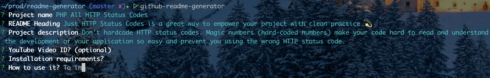

# GitHub Markdown README Generator

## 📄 Description

A very simple &amp; quick way to generate outstanding README files for your next GitHub project 🚀

The generated README files are highly **optimized for SEO** and **eye-catching for your readers** 🥳


## 🛠 Installation

If you edit the script on your machine, you will have to run `npm link` to locally _symlink_ the package, and then run `github-readme-generator` in your terminal.


## 🎮 Usage

```bash
npx github-readme-generator
```




## :tv: Video

[](https://www.youtube.com/watch?v=knK7JMwxl3M)

👉 **[Click here to watch on YouTube](https://www.youtube.com/watch?v=knK7JMwxl3M)** 🎉


## 😋 Who cooked it?

[](https://ph7.me 'My personal website :-)')

[![@phenrysay][twitter-image]](https://twitter.com/phenrysay) [![pH-7][github-image]](https://github.com/pH-7)

**[Pierre-Henry Soria](https://ph7.me)**, a highly pragmatic passionate, zen &amp; cool software engineer 😊


## ⚖️ License

Generously distributed under the _[MIT](https://opensource.org/licenses/MIT)_


<!-- GitHub's Markdown reference links -->
[twitter-image]: https://img.shields.io/badge/Twitter-1DA1F2?style=for-the-badge&logo=twitter&logoColor=white
[github-image]: https://img.shields.io/badge/GitHub-100000?style=for-the-badge&logo=github&logoColor=white

<!-- Was generated by README Generator CLI on 2021-12-25 https://github.com/pH-7/github-readme-generator-cli -->
